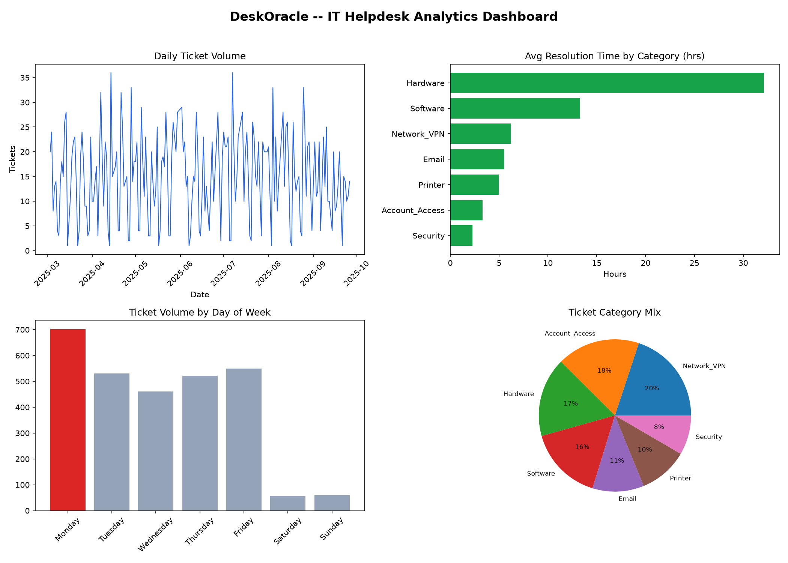
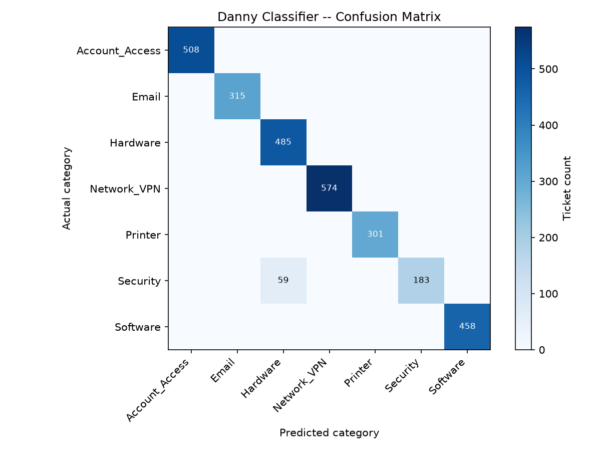

# DeskOracle

[](https://github.com/TR3V77/DeskOracle/actions/workflows/tests.yml)

An AI-assisted IT helpdesk ticket triage system: submit a plain-English
ticket description, and it retrieves relevant internal knowledge-base
articles (RAG), predicts a category and priority, and drafts a suggested
response. Built as a self-contained project spanning three disciplines:
software engineering, data analytics, and product/UX design.

## Why this project

Real enterprise helpdesks triage thousands of tickets manually. This
project demonstrates an end-to-end AI-native approach to that problem:
retrieval-augmented generation over a knowledge base, an LLM agent with a
deterministic offline fallback, and the data analysis needed to know
whether the automation actually works.

## What's in it

| Area | What it shows |
|---|---|
| **Software Engineering** | FastAPI backend, RAG pipeline (TF-IDF retrieval over a markdown knowledge base), LLM agent integration (Claude) with a rule-based offline fallback so the app always runs, 22 passing pytest tests (including mocked LLM-path coverage) |
| **Data Analytics** | A synthetic-but-realistic 2,900-ticket dataset, a classifier evaluation (98% accuracy, per-category precision/recall/F1, confusion matrix), and a 4-panel operational dashboard (volume trends, resolution time by category, weekday spikes, category mix) |
| **Product Design** | A Streamlit UI so the triage agent is actually usable, not just an API |

## Architecture

```
Ticket description
       |
       v
  RAG retrieval (TF-IDF cosine similarity over data/kb_articles/*.md)
       |
       v
  Triage engine (backend/triage.py)
    - LLM mode: Claude reasons over retrieved KB context -> category, priority, response
    - Fallback mode: deterministic keyword classifier (used with no API key, and for
      the offline-reproducible analytics evaluation below)
       |
       v
  TriageResponse (category, priority, suggested response, matched KB articles)
```

## Key results

- **98.0% overall triage accuracy** against the 2,883-ticket synthetic dataset (see
  `analytics/evaluation_report.txt`)
- Weakest category: **Security recall at 75.6%** — some phishing/malware tickets get
  misclassified as Hardware because the description mentions a device ("laptop acting
  strange") without an explicit security keyword. A real error-analysis finding, not
  a bug — the kind of gap you'd catch in a precision/recall review before shipping.
- **Monday ticket volume is 93% higher** than the average of all other days of the week, consistent with
  VPN/network reconnect issues after the weekend — an actionable staffing signal.





## Running it

```bash
python -m venv .venv
source .venv/bin/activate       # Windows (cmd/PowerShell): .venv\Scripts\activate
                                 # Windows (Git Bash):       source .venv/Scripts/activate
pip install -r requirements.txt

# Generate the synthetic dataset
python data/generate_tickets.py

# Run tests
pytest tests/ -v

# Run the analytics (writes analytics/evaluation_report.txt, *.png)
python analytics/evaluate_triage.py
python analytics/dashboard.py

# Run the API
uvicorn backend.app:app --reload
# -> http://127.0.0.1:8000/docs

# Run the UI
streamlit run app_ui.py
```

To enable live LLM triage instead of the offline fallback, set
`ANTHROPIC_API_KEY` before running.

## Notes on the dataset

`data/tickets.csv` is synthetic, generated by `data/generate_tickets.py` with
category-specific description templates, weighted priority distributions, and
resolution-time ranges modeled loosely on typical enterprise helpdesk patterns
(e.g., hardware tickets take longer to resolve than password resets, Monday
volume spikes). It's not real user data — generated so the project is
self-contained and instantly reproducible.

## License

MIT — see [LICENSE](LICENSE).
